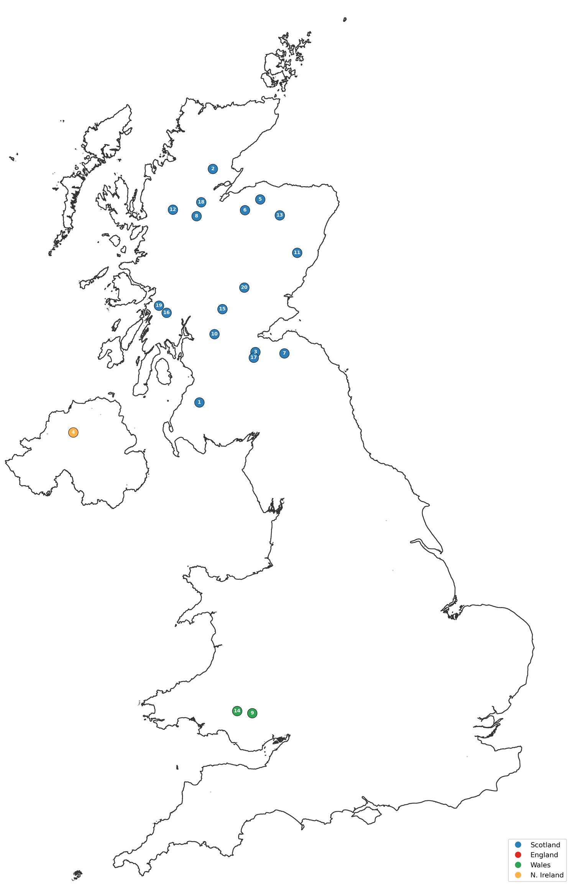
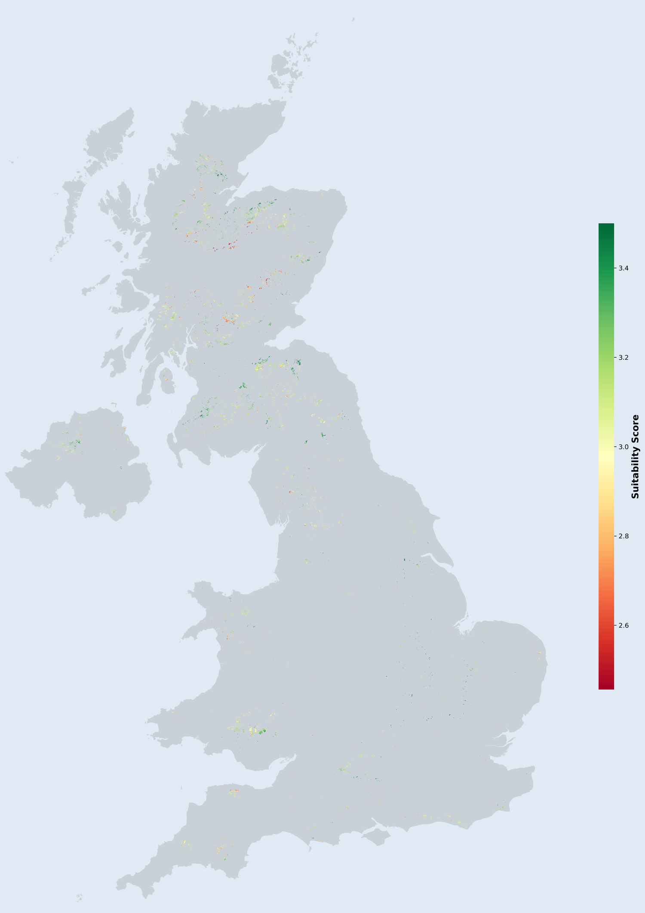
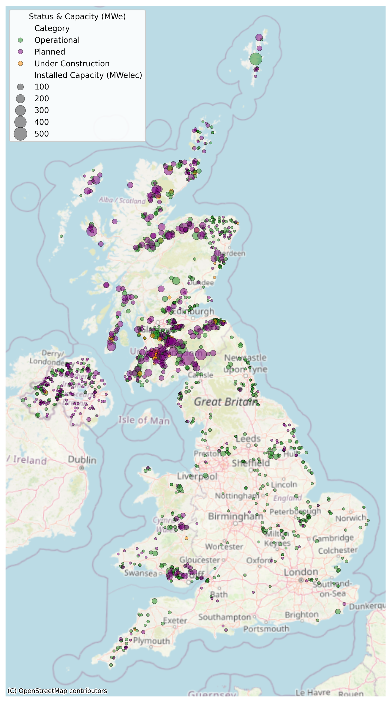
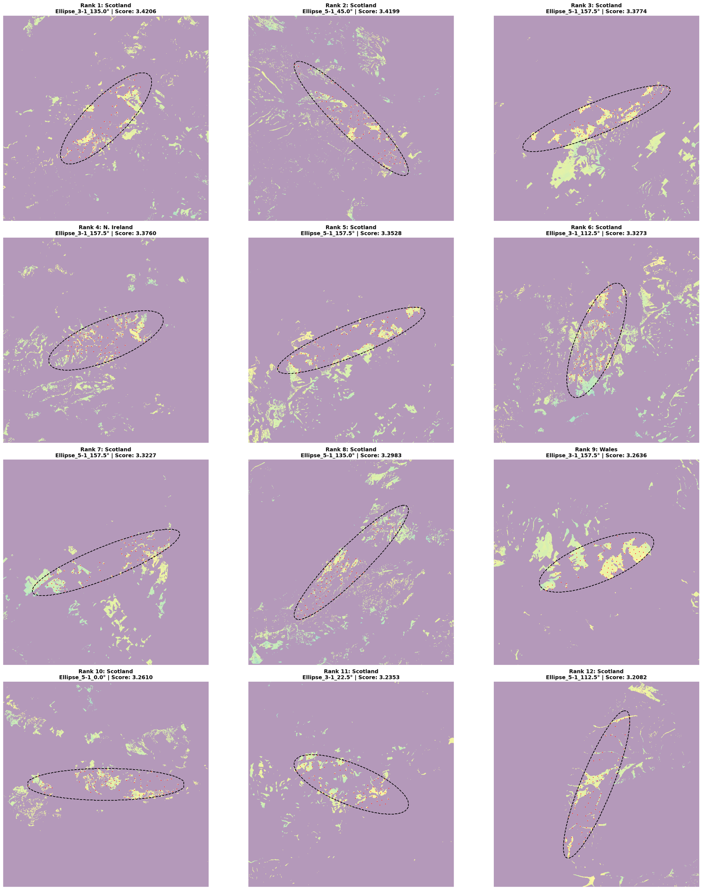

# Spatial & Financial Assessment of 10 GW Onshore Wind Capacity in the UK

> Evaluating **20 strategic 0.5 GW wind-farm clusters** for the UK National Grid — a GIS multi-criteria (AHP) suitability analysis combined with a discounted cash-flow viability study.

<p align="center">
  
  
</p>
<p align="center"><em>Left: the 20 recommended 0.5 GW sites &nbsp;·&nbsp; Right: the UK-wide suitability index (red = low, green = high)</em></p>

---

## Overview

The UK is legally committed to Net Zero by 2050 and a fully decarbonised power sector by 2035. Onshore wind is among the cheapest, fastest-to-deploy technologies — but land scarcity forces a trade-off between energy yield, environmental protection, and social acceptance.

This project answers three questions:

1. **Spatial distribution** — what are the current geographic patterns and scales of UK onshore wind?
2. **Strategic site selection** — where are the 20 most suitable locations for 0.5 GW wind farms, based on a multi-criteria spatial assessment?
3. **Economic viability** — is the 10 GW expansion financially robust, and does it need subsidies?

## Key results

| | |
|---|---|
| **20 sites identified**, 0.5 GW each → **10 GW** total | **17 Scotland · 2 Wales · 1 Northern Ireland · 0 England** |
| AHP weighting with **Consistency Ratio = 0.003** (≪ 0.10) | Wind speed & grid congestion are the dominant criteria (28.7% each) |
| Portfolio **IRR ≈ 12.0–12.8%**, well above the **5.8% hurdle rate** | **LCOE ≈ £44–46/MWh** — viable without substantial subsidy |
| 66.7 m master grid, British National Grid (EPSG:27700) | 81 turbines per **125 km²** footprint, wake-spacing enforced |

**Headline finding:** suitable large-scale (0.5 GW) sites are overwhelmingly concentrated in Scotland. No qualifying site exists in England under the spatial constraints, which makes the 10 GW programme critically dependent on long-distance transmission and grid reinforcement to reach demand centres in the south.

---

## Methodology

The workflow runs in three notebooks, in order:

### 1 · Exploratory data analysis & suitability index — [`01_suitability_map.ipynb`](01_suitability_map.ipynb)

All heterogeneous inputs (vector shapes, XML aviation data, GeoTIFF rasters) are reprojected to the **British National Grid (EPSG:27700)** and harmonised onto a single **66.7 m master grid** covering Great Britain and Northern Ireland. A binary **exclusion mask** removes infeasible areas (disallowed land use; buffers around roads 220 m, transmission lines 160 m, urban areas 1,125 m; existing wind & PV with 600 m spacing; aviation/UAS restriction zones). Every eligible pixel is then scored 1–5 against seven criteria and combined with **Analytic Hierarchy Process (AHP)** weights:

| # | Criterion | Weight |
|---|-----------|:------:|
| C1 | Wind speed | **0.287** |
| C7 | Grid congestion (regional) | **0.287** |
| C2 | Road proximity | 0.088 |
| C3 | Grid proximity | 0.088 |
| C4 | Urban distance | 0.088 |
| C5 | Slope | 0.081 |
| C6 | Protected-area distance | 0.081 |

The weights derive from a 7×7 pairwise comparison matrix (Saaty 1–9 scale) with **CR = 0.003**, confirming logically consistent judgements.

$$S = 0.287\,x_{\text{Wind}} + 0.287\,x_{\text{Congest}} + 0.088\,(x_{\text{Grid}} + x_{\text{Road}} + x_{\text{Urban}}) + 0.081\,(x_{\text{Slope}} + x_{\text{Prot}})$$

<p align="center"></p>
<p align="center"><em>Current onshore wind farms — a clear North–South disparity, with Scotland dominating both count and capacity.</em></p>

### 2 · Best-20 site search — [`02_site_search.ipynb`](02_site_search.ipynb)

A custom geometry-based algorithm turns the continuous suitability surface into 20 discrete sites:

- **Geometric kernels** — a library of footprints (square, circle, and 3:1 / 5:1 ellipses rotated in 22.5° steps), each with a gross area of **125 km²** (power density 4 km²/MW).
- **Convolutional scanning** — each kernel is convolved over the suitability raster to find regions of high cumulative potential.
- **Turbine placement** — for each candidate centroid, 81 turbines are greedily placed on the highest-suitability pixels subject to a minimum wake-spacing distance.
- **Global ranking & quotas** — sites are ranked by mean suitability and allocated under regional quotas (Scotland/England/Wales/NI), with a **fallback** that re-allocates any unmet quota to the highest-ranking Scottish candidates so the national target of 20 sites is always met.

<p align="center"></p>
<p align="center"><em>Close-ups of the top sites — purple = excluded, yellow→green = suitability, red points = optimised turbine positions.</em></p>

### 3 · Financial viability — [`03_financial_analysis.ipynb`](03_financial_analysis.ipynb)

A full discounted cash-flow model computes **NPV, IRR and LCOE** for each site (35-year lifetime, 5.8% discount rate), with site-specific grid-connection cost scaling with distance to the high-voltage network. A **sensitivity analysis** sweeps electricity price (£50–90/MWh) against CapEx (90–120%).

| Parameter | Value | Parameter | Value |
|---|---|---|---|
| Capacity / farm | 500 MW | Electricity price | £73.8/MWh (CfD AR6) |
| Lifetime | 35 yr | CapEx | £1.588 M/MW |
| Capacity factor | 33% (Eng) / 38.1% (Sco, Wal, NI) | OpEx | £40.1 k/MW·yr |
| Discount rate | 5.8% | Grid connection | £2.03 M/MW·km |

**Result:** every site clears the hurdle rate (IRR 11.9–12.8%, LCOE £44–46/MWh). The only loss-making scenario is the pessimistic combination of a £50/MWh price *and* a 20% CapEx overrun — the portfolio is otherwise resilient.

---

## Selected sites (top 10 of 20)

| Rank | Region | Avg. suitability | HV distance (km) | NPV (£M) | IRR (%) | LCOE (£/MWh) |
|:---:|---|:---:|:---:|:---:|:---:|:---:|
| 1 | Scotland | 3.42 | 0.47 | 735.65 | 12.78 | 44.10 |
| 2 | Scotland | 3.42 | 3.12 | 730.27 | 12.69 | 44.32 |
| 3 | Scotland | 3.38 | 2.80 | 730.92 | 12.70 | 44.30 |
| 4 | N. Ireland | 3.38 | 0.88 | 734.82 | 12.76 | 44.14 |
| 5 | Scotland | 3.35 | 3.59 | 729.32 | 12.67 | 44.36 |
| 6 | Scotland | 3.33 | 8.09 | 720.18 | 12.52 | 44.73 |
| 7 | Scotland | 3.32 | 1.88 | 732.79 | 12.73 | 44.22 |
| 8 | Scotland | 3.30 | 4.58 | 727.30 | 12.64 | 44.44 |
| 9 | Wales | 3.26 | 4.74 | 726.98 | 12.63 | 44.45 |
| 10 | Scotland | 3.26 | 5.99 | 724.44 | 12.59 | 44.56 |

Coordinates (British National Grid, EPSG:27700) for all 20 sites are produced in notebook 02.

---

## Repository structure

```
.
├── 01_suitability_map.ipynb      # AHP multi-criteria suitability index → GeoTIFF
├── 02_site_search.ipynb          # geometry-based search for the best 20 sites
├── 03_financial_analysis.ipynb   # NPV / IRR / LCOE + sensitivity analysis
├── figures/                      # key result maps used in this README
├── requirements.txt
└── DATA.md                       # input datasets & where to obtain them
```

## Running the notebooks

```bash
python -m venv .venv && source .venv/bin/activate   # or use conda
pip install -r requirements.txt
jupyter lab
```

The notebooks expect the raw geodata under `./Data/...` and write intermediate rasters to `./Sripts/Output/...` (paths are relative to the repo root). The datasets are large and licensed by their providers, so they are **not** redistributed here — see [`DATA.md`](DATA.md) for sources and the expected folder layout. Run the notebooks in order: `01` produces the suitability GeoTIFF that `02` consumes.

## Data sources

UK Land Cover Map (UKCEH) · Global Wind Atlas (wind speed) · SRTM (terrain slope) · OpenStreetMap via Geofabrik (roads) · National Grid / transmission-line geometries · JNCC Special Areas of Conservation & Special Protection Areas (protected areas) · CAA UAS aviation restriction zones · DESNZ Renewable Energy Planning Database (existing wind & PV). Full attributions in [`DATA.md`](DATA.md).

## Limitations

- Regional **grid-congestion** scoring (C7) is a coarse, region-level proxy rather than a node-level capacity model.
- The 0.5 GW footprint requirement is deliberately strict; smaller modular clusters (100–250 MW) would unlock more balanced siting across England and NI.
- Capacity factors and cost assumptions are point estimates from published industry data (see the sensitivity analysis for the response surface).

## Notes

Spatial analysis of energy data. A full written report accompanies this code repository.
